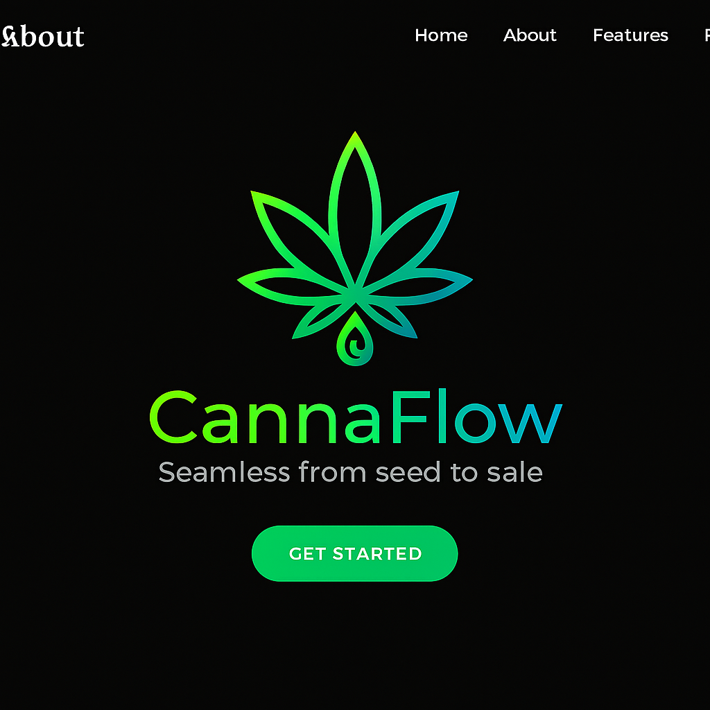

# CannaFlow Advanced - Complete Cannabis Business Management System



## 🌟 Overview

CannaFlow Advanced is a comprehensive, dual-mode cannabis business management system designed for both retail dispensaries and licensed producers. Built with React Native and Expo, it provides a complete solution for inventory management, point of sale, compliance tracking, analytics, and AI-powered assistance.

## 🚀 Key Features

### Dual-Mode Business System
- **Retail Store Mode**: Complete POS, sales tracking, customer management
- **Licensed Producer Mode**: Plant tracking, harvest management, compliance
- Seamless mode switching with data preservation

### Comprehensive Analytics
- Real-time sales analytics
- Top products and categories
- Strain type analysis
- Inventory metrics
- Visual charts and graphs
- Exportable reports

### AI-Powered Assistant
- Voice command support
- Natural language processing
- Context-aware responses
- Analytics queries
- Strain information
- Business insights

### Extensive Strain Database
- 400+ cannabis strains (expandable to 2500+)
- Indica/Sativa/Hybrid classification
- Voice recognition
- Search and autocomplete
- AI integration

### Compliance Management
- Toggleable compliance mode
- Regulatory reporting
- Audit trails
- Deadline tracking
- Documentation management

### Advanced Inventory
- Product management
- Stock tracking
- Low stock alerts
- Barcode support
- Category organization
- Strain-based filtering

### Point of Sale
- Fast checkout
- Multiple payment methods
- Receipt generation
- Sales history
- Transaction tracking

### Cash Float Management
- Daily float operations
- Variance tracking
- Auto-close feature
- Historical reports

## 📋 System Requirements

### Mobile
- **iOS**: 13.0 or later
- **Android**: 5.0 (API 21) or later

### Web
- Modern browsers (Chrome, Firefox, Safari, Edge)

### Storage
- Minimum: 50 MB
- Recommended: 200 MB

## 🛠️ Installation

### Prerequisites
```bash
node >= 18.0.0
npm >= 9.0.0
expo-cli >= 6.0.0
```

### Setup Steps

1. **Clone the repository**
```bash
git clone https://github.com/valleyboyzz0024-del/Cannaflowadvanced.git
cd Cannaflowadvanced/cannaflow-clean
```

2. **Install dependencies**
```bash
npm install
```

3. **Start the development server**
```bash
npm start
```

4. **Run on specific platform**
```bash
# iOS
npm run ios

# Android
npm run android

# Web
npm run web
```

## 📱 First Time Setup

### 1. Business Type Selection
On first launch, select your business type:
- **Retail Store**: For dispensaries and retail operations
- **Licensed Producer**: For cultivation facilities

### 2. Login
Use default credentials:
- Username: `admin`
- Password: `admin123`

### 3. Configure Settings
- Set compliance mode
- Configure business preferences
- Set up cash float

## 🎯 Usage Guide

### Retail Store Mode

**Dashboard**
- View sales summary
- Quick access to key metrics
- Recent transactions

**Sales**
- Add products to cart
- Process transactions
- Generate receipts
- View sales history

**Analytics**
- Sales trends
- Top products
- Category performance
- Inventory status

**Inventory**
- Manage products
- Update stock
- Track inventory value
- Set alerts

### Licensed Producer Mode

**Dashboard**
- Plant statistics
- Grow room status
- Harvest tracking
- Compliance overview

**Analytics**
- Production metrics
- Batch performance
- Inventory analysis
- Compliance reports

**Inventory**
- Product management
- Batch tracking
- Stock levels
- Traceability

**Compliance**
- Regulatory tracking
- Documentation
- Audit trails
- Reporting

## 🤖 AI Assistant Usage

### Voice Commands
```
"Add two grams of Blue Dream to cart"
"What are my top selling products?"
"Show me today's sales"
"Tell me about OG Kush"
"Open cash float with $200"
```

### Text Commands
- Product searches
- Analytics queries
- Strain information
- Inventory checks
- Sales data

## 📊 Analytics Features

### Available Metrics
- Total sales and revenue
- Average order value
- Top selling products
- Category distribution
- Strain type analysis
- Inventory value
- Stock levels
- Low stock alerts

### Time Periods
- Today
- This Week
- This Month
- This Year
- All Time

### Export Options
- JSON format
- Complete analytics package
- Shareable reports

## 🔒 Security Features

- Encrypted data storage
- Secure authentication
- Role-based access control
- Session management
- Audit logging

## 🌿 Strain Database

### Included Strains (400+)
- Blue Dream (Hybrid)
- OG Kush (Hybrid)
- Sour Diesel (Sativa)
- Girl Scout Cookies (Hybrid)
- Purple Punch (Indica)
- Jack Herer (Sativa)
- Northern Lights (Indica)
- Gelato (Hybrid)
- Wedding Cake (Hybrid)
- And 390+ more...

### Strain Features
- Type classification
- Voice recognition
- Search functionality
- AI integration
- Autocomplete

## 📝 Compliance Mode

### When Enabled
- Detailed tracking
- Regulatory reports
- Audit trails
- Documentation
- Deadline monitoring

### When Disabled
- Simplified interface
- Basic tracking
- Streamlined operations

## 🔧 Configuration

### Settings Options
- Business type
- Compliance mode
- User preferences
- Cash float settings
- Notification preferences

## 📖 Documentation

- [Complete Feature Documentation](./FEATURES_DOCUMENTATION.md)
- [Testing Checklist](./TESTING_CHECKLIST.md)
- [AI Compliance Guide](./README_AI_COMPLIANCE.md)
- [Installation Guide](./INSTALLATION_GUIDE.md)

## 🐛 Troubleshooting

### Common Issues

**App won't start**
```bash
# Clear cache and reinstall
rm -rf node_modules
npm install
npm start -- --clear
```

**Database errors**
```bash
# Reset database
# Delete app data and reinstall
```

**Navigation issues**
```bash
# Clear navigation state
# Logout and login again
```

## 🚀 Deployment

### Building for Production

**iOS**
```bash
expo build:ios
```

**Android**
```bash
expo build:android
```

**Web**
```bash
expo build:web
```

## 🤝 Contributing

We welcome contributions! Please follow these steps:

1. Fork the repository
2. Create a feature branch
3. Make your changes
4. Test thoroughly
5. Submit a pull request

## 📄 License

This project is proprietary software. All rights reserved.

## 👥 Support

### Getting Help
- **Email**: support@cannaflow.com
- **Documentation**: Built-in help system
- **Issues**: GitHub Issues

### Training Resources
- User guides
- Video tutorials
- Quick start guide
- Best practices

## 🎉 Acknowledgments

Built with:
- React Native
- Expo
- React Navigation
- React Native Paper
- AsyncStorage
- And many other amazing open-source libraries

## 📊 Project Status

**Version**: 1.0.0
**Status**: Production Ready
**Last Updated**: 2025-09-30

## 🔮 Roadmap

### Upcoming Features
- [ ] Customer loyalty program
- [ ] Advanced reporting
- [ ] Multi-location support
- [ ] Cloud synchronization
- [ ] Integration APIs
- [ ] Mobile payments
- [ ] Delivery management
- [ ] Customer portal
- [ ] Advanced compliance tools
- [ ] Plant tracking (Grow mode)
- [ ] Harvest management (Grow mode)
- [ ] Batch tracking (Grow mode)

## 📞 Contact

**CannaFlow Advanced**
- Website: www.cannaflow.com
- Email: info@cannaflow.com
- Support: support@cannaflow.com

---

**© 2025 CannaFlow Advanced. All rights reserved.**

*Seamless from seed to sale* 🌿